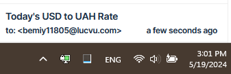

# gses_case

HTTP server in Go that sends USD/UAH rates in to subscribed users by email.

## Requirements

| Stated | Implementation | Done |
| ------ | -------------- | ---- |
| PHP, Go, or Node | Go | ✅ |
| HTTP server | Gin | ✅ |
| ⠀⠀get:/rate |  | ✅ |
| ⠀⠀post:/subscribe |  | ✅ |
| ⠀⠀post:/sendEmails |  | ✅ |
| Get exchange rate | net/http | ✅ |
| Send emails | gomail | ✅ |
| Periodic jobs | robfig/cron | ✅ |
| Database | sqlite, sqlx | ✅ |
| Migration | sqlx-migrations | ✅ |
| Swagger | swaggo | ✅ |
| Containerize | Docker, alpine | ✅ |
| Run migration on start | Docker-compose, sqlx-cli | ✅ |
| Tests |  |  |

## Evidence

GET /rate:

Sent emails:

Cron job worked (with `@hourly` setting):

Swagger:

