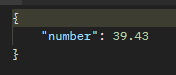
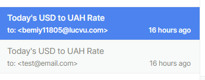
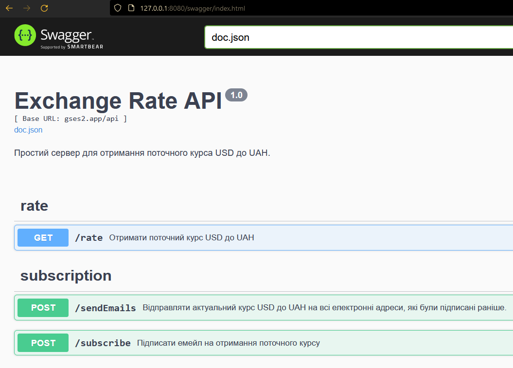

# gses_case

HTTP server in Go that sends USD/UAH rates in to subscribed users by email.

## Requirements

| Stated | Implementation | Done |
| ------ | -------------- | ---- |
| PHP, Go, or Node | Go | ✅ |
| HTTP server | Gin | ✅ |
| ⠀⠀get:/rate |  | ✅ |
| ⠀⠀post:/subscribe |  | ✅ |
| ⠀⠀post:/sendEmails |  | ✅ |
| get exchange rate | net/http | ✅ |
| send emails | gomail | ✅ |
| periodic jobs | robfig/cron | ✅ |
| Docker-compose |  |  |
| Database | sqlite, sqlx | ✅ |
| migration | sqlx-migrations | ✅ |
| swagger | swaggo | ✅ |
| tests |  |  |

## Evidence

GET /rate:

Sent emails:

Swagger:

